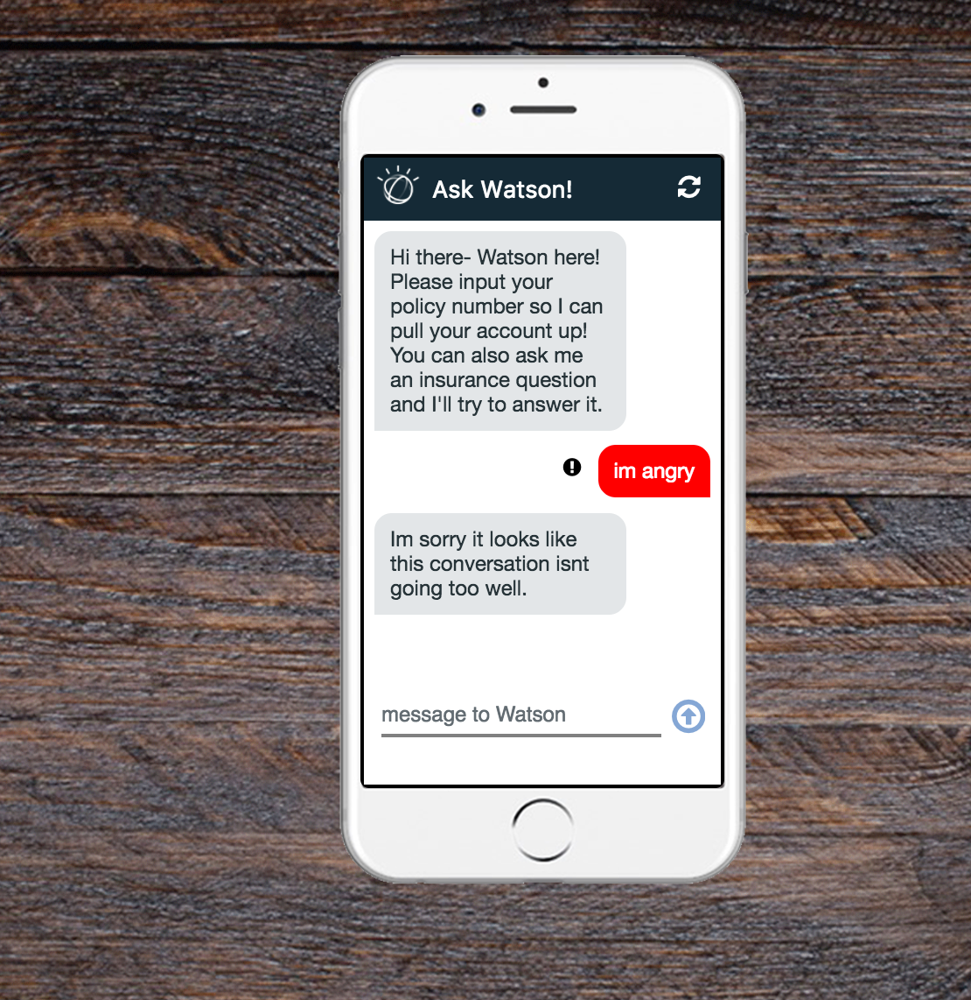
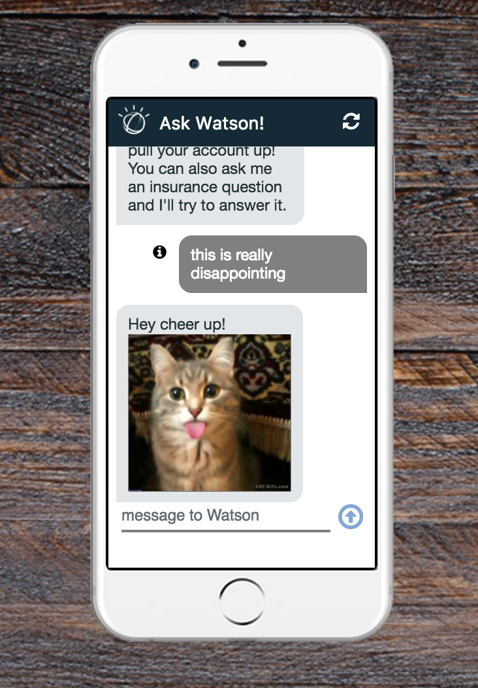

# Watson Conversation Desktop iPhone GUI

## Overview

This Watson Accelerator framework combines Watson Conversation, Watson Discovery, and Watson Tone Analyzer to allow for the creation an empathetic chatbot in the pixel dimensions of an iPhone 6+ to simulate what such a chatbot could look like on a mobile interface.


To see a native iOS version of this application, check out this repo here <COMING SOON>

# Required Services

This Accelerator requires the following:

- Watson Conversation
- Watson Discovery Service
- Watson Tone Analyzer

# Description

The high-level steps to get this application running is as follows;

1. Create a trained Conversation workspace.
2. Upload documents to a Discovery collection and train query results if necessary.
3. Hookup required Watson services to the application server.

## Prerequisites

The application requires the following software to be installed locally.

1. Node (7.8+) Application runtime environment
2. NPM (5.5+) Server side dependency management
3. Angular CLI (1.0.0) `npm install -g @angular/cli`

> If you have Angular CLI already installed.  Please read the upgrade instructions for Angular CLI when you upgrade the software.

# Setup Instructions

The setup is done in 3 primary steps.  You will download the code, setup the application, and then deploy the code to Bluemix.  If you would like to run the code locally, there will be one more step to configure the credentials locally.

## Downloading the code

1. Clone the app to your local environment from your terminal using the following command:

  ```
  git clone https://github.ibm.com/Watson-Solutions-Lab/decision-support.git
  ```
2. `cd` into this newly created directory

## Setting up Bluemix

> Explanation: You will create a placeholder application in Bluemix that connects to all the required services first.

1. If you do not already have a Bluemix account, [sign up here](https://console.ng.bluemix.net/registration).
2. Download and install the [Cloud Foundry CLI](https://console.ng.bluemix.net/docs/cli/index.html#cli) tool.
3. Log into Bluemix with our account.
4. From the Application Dashboard, Create a new Application.
  - On the left, select Apps > Cloudfoundry Apps.
  - On the right, select SDK for Node.js.
  - Provide a unique name for your application.
5. Once the application is created, go into the application and select Connections.
6. Create the required services and bind them to the newly created application.
7. Leave the Connections page open, as you will reference the credentials in the subsequent setup step.

Watson Tone Analyzer does not require any configuration.  For help on configuring and training Conversation, and Discovery, see below.

### Configuring & Training Watson Conversation

There is no pre-trained Conversation workspace for this prototype.

Create a custom dialog flow in the [Watson conversation tooling](https://ibmwatsonconversation.com) as you would normally, using intents and entities to route your dialog flow.

A conversation flow for this prototype should include a node for long tail responses to be answered by a segment of text in a Watson Discovery Service (WDS) collection.  This node can either be triggered by a "true" condition node on the bottom of your dialog flow logic, or by training a specific #LONG_TAIL intent for the conversation dialog to hit when a question is asked that you would like to be handled by WDS.

The prototype application logic fires off the input text when the conversation output has the attribute "call_discovery" == true

Therefore, in your long-tail node, edit the output object in the Conversation tooling to include "call_discovery" : true


### Configuring & Training Watson Discovery Service

Upload and train your Discovery collection as needed.

### Note About Tone Analyzer

The way the prototype is currently set up, the Tone Analyzer part of the application interprets user input text and if it is impolite with a 60% confidence or frustrated with a 68% confidence, the system does not send the text to Conversation, but interjects and says a message prompted from the application layer.

At this point, you can do many different things to fix a bad conversation such as- offer a coupon, show a map of the nearest location, show a telephone number to call, or even have an orchestration to another service like ServiceNow, IBM Voice Gateway, or some other warm handoff system.

The confidence levels can be changed as you see fit.  I selected those levels from simple testing of impolite and frustrated phrases.



Similarly, if the user's text is interpreted as 70% sadness, a silly cat giphy will appear.  Again this can be customized as you'd like.




## Setting up Local Configuration files

There are 2 sample configuration files that are required by the application.

The `env-vars-example.json` file should be copied to `env-vars.json` before the application is executed on Bluemix or locally.

The `vcap-local-example.json` file should be copied to `vcap-local.json` before the application is executed locally.  This file contains your service credentials required to run the application locally.  If the app is run on Bluemix, the app will use the VCAP service information on Bluemix.  The sample file is a skeleton of what is required, but, you have to fill in the details.

> The `env-vars.json` file is where all the parameters of this application is kept.  The setup utility, explained later, will guide you through setting up the parameters in this file, but you can come back and modify them at any time.

## Installing the dependencies

The server dependencies are controlled and defined in [the main package.json](./package.json).

The client dependencies are controlled and defined in [the client package.json](./client/package.json).

Run the following command, from the application folder, to install both the client and server dependencies.

```
npm install
```

## Running the app on Bluemix

Use the name of the application you created previously to update the configuration files locally.

1. Open the `manifest.yml` file and change the `name` AND `host` value to the unique application name you created on Bluemix previously.

2. Compile the Angular client code using the following command.

  ```
  $ npm run build:client
  ```
3. Connect to Bluemix in the command line tool and follow the prompts to log in

  ```
  $ cf login -a https://api.ng.bluemix.net
  ```
4. Push the app to Bluemix.

  ```
  $ cf push
  ```
5. The application should now be running on Bluemix and listening to Tweets.  You can access the application URL using the application name you defined in the manifest.yml file with a '.mybluemix.net' appended to it.

6. The application is secured with a username and password. See the end of this README for details.

## Running the app locally

To run the application locally (your own computer), you have to install additional Node.js modules and configure the application with some credentials that is provisioned on Bluemix.

### Starting the application

There are a few quick steps required to stand up the application. In general, the required tasks are.

1. Install the server and client dependencies
2. Commission the required services
3. Configure the environment variables in manifest.yml (cloud deployment) or .env (local deployment)
4. Build and run or deploy

## The Local VCAP file

The vcap-local.json file consist of your Bluemix service credentials when you run the application locally.

This file must be updated with your service credentials before the application can be executed.

1. On the Bluemix Application page, select the Connections option on the left.
2. Select each of the services you provisioned earlier and view the credentials.
3. Copy the credentials using the 'copy' icon.
4. Edit the vcap-local.json file.
5. Paste the content of the clipboard into the vcap.local file.
6. The structure of this file consist of a service name and a json object, but the pasted value is wrapped in another ```{ }``` that should be removed.
7. A sample of what it should look like below;

```
"conversation": [
  {
    "credentials": {
      "url": "https://gateway.watsonplatform.net/conversation/api",
      "username": "USERNAME",
      "password": "PASSWORD"
    },
    "syslog_drain_url": null,
    "volume_mounts": [],
    "label": "conversation",
    "provider": null,
    "plan": "free",
    "name": "Conversation-31",
    "tags": [
      "watson",
      "ibm_created",
      "ibm_dedicated_public",
      "lite"
    ]
  }
]
```

8. Once all the credentials are in place, the application can be starter with `npm run develop`.

## Accessing the Application

There is only 1 user required for this application.  This user is `watson` with a password of `p@ssw0rd`

The user names and passwords can be modified in the /server/boot/init-access.js file.
